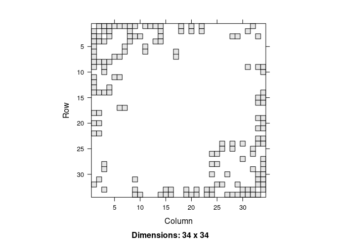
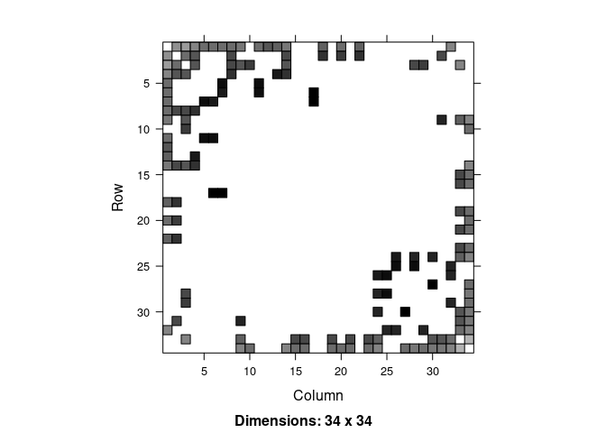
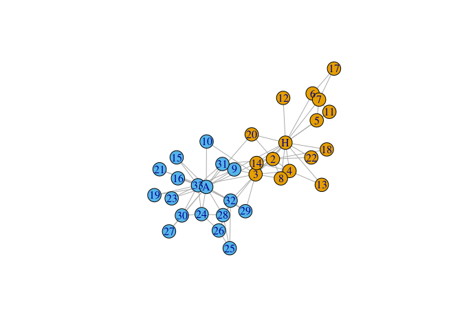

<!-- README.md is generated from README.Rmd. Please edit that file -->

# invertiforms

<!-- badges: start -->

[](https://github.com/RoheLab/invertiforms/actions)
[](https://app.codecov.io/gh/RoheLab/invertiforms?branch=master)
<!-- badges: end -->

The goal of invertiforms is to provide composable, invertible
transformations of sparse matrices. These transformations are primarily
useful for network analysis. For example, we provide transforms to row
and column center a graph adjacency matrix. This transformation could
then be composed with a degree-normalized transformation, and so on. The
original adjacency matrix can be recovered by applying inverse
transformation. Primarily, this package is for other developers working
on spectral matrix packages, but it may also be useful for advanced
users who don’t want to go to the hassle of coding up matrix
transformations on their own.

## Installation

You can install the released version of invertiforms from
[CRAN](https://CRAN.R-project.org) with:

``` r
install.packages("invertiforms")
```

You can install the development version from
[GitHub](https://github.com/) with:

``` r
# install.packages("devtools")
devtools::install_github("RoheLab/invertiforms")
```

## Transformations

At the moment, we provide convenient tools to:

-   row center,
-   column center, and
-   row and column center

a matrix. Similarly, we provide tools to transform a graph adjacency
matrix into the:

-   normalized graph Laplacian,
-   regularized graph Laplacian, and
-   perturbed graph Laplacian.

## Example usage

Here we show how `invertiforms` might help you quickly perform
regularized spectral clustering. First we grab some network data and
quickly visualize the adjacency matrix.

``` r
library(invertiforms)
#> Loading required package: Matrix
#> 
#> Attaching package: 'invertiforms'
#> The following object is masked from 'package:base':
#> 
#>     transform
library(igraph)
#> 
#> Attaching package: 'igraph'
#> The following objects are masked from 'package:stats':
#> 
#>     decompose, spectrum
#> The following object is masked from 'package:base':
#> 
#>     union
library(igraphdata)

data("karate", package = "igraphdata")

A <- get.adjacency(karate)
image(A)
```



Now we construct the regularized degree normalized graph Laplacian and
visualize it.

``` r
iform <- RegularizedLaplacian(A, tau_row = 35, tau_col = 35)

L <- transform(iform, A)
image(L)
```



Recovering `A` from `L` is straightforward:

``` r
A_recovered <- inverse_transform(iform, L)

all.equal(A, A_recovered, check.attributes = FALSE)
#> [1] TRUE
```

Once we have `L` we can do spectral tricks with it. Here we estimate
`k = 2` clusters.

``` r
set.seed(27)

k <- 2
L_svd <- svd(L, k)

safe_project_sphere_rowwise <- function(x, eps = 1e-10) {
  sc <- drop(apply(x, 1L, function(y) sum(y^2)))
  sc[sc < eps] <- 1
  x / sqrt(sc)
}

U <- safe_project_sphere_rowwise(L_svd$u)
km <- kmeans(U, k, nstart = 50)

V(karate)$color <- km$cluster
plot(karate)
```



## Related work

[`recipes`](https://cran.r-project.org/package=recipes) provides
non-invertible, composable transformations for tabular data.
[`softImpute`](https://cran.r-project.org/package=softImpute) provides
an `Incomplete` S4 Matrix class that can be used for double centering
sparse matrices.
